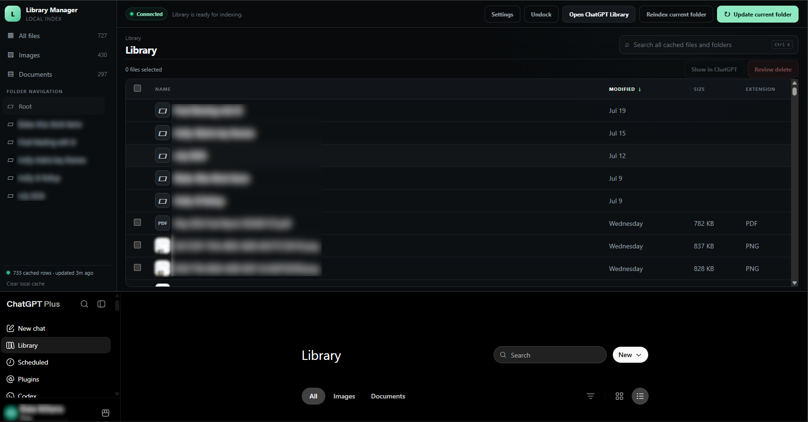

# ChatGPT Library Manager — 0.8.1

An installable Chrome extension that gives the ChatGPT Library a fast, locally cached file-explorer view.

## Quick installation

1. Download the ZIP from the [latest release](https://github.com/Klownicle/chatgpt-library-manager/releases/latest).
2. Extract the downloaded ZIP to a folder. Chrome cannot load the ZIP directly.
3. Open `chrome://extensions` in Chrome.
4. Turn on **Developer mode** in the upper-right corner.
5. Click **Load unpacked**.
6. Select the extracted `chatgpt-library-manager-0.8.1` folder containing `manifest.json`.
7. Open [ChatGPT Library](https://chatgpt.com/library), then click the extension's toolbar icon.

> [!IMPORTANT]
> This is an independent, unofficial project and is not affiliated with or endorsed by OpenAI. ChatGPT's Library UI and private request formats can change without notice. Review selections carefully before deleting files.

## No warranty or support

This software is provided **AS IS**, without support, warranties, guarantees, or promises of fitness for any purpose. You install and use it entirely at your own risk. The authors and contributors are not responsible for deleted or lost data, account restrictions, service interruptions, software or system damage, hardware damage, security incidents, or any other direct or indirect loss arising from its use, to the fullest extent permitted by law.

This project's code and documentation were generated by AI and have not been independently audited. AI-generated material can be incomplete, incorrect, insecure, or unsafe. No responsibility is accepted for its accuracy, reliability, operation, or consequences of use.

This repository is provided without support. Support requests, feature requests, issue reports, and other community participation are not accepted.

## Usage

### Indexing buttons

Indexing reads the currently selected ChatGPT Library folder, scrolls through its virtual list, and saves the observed metadata in the extension's local cache. Keep the manager docked above the Library and leave the Library tab visible while a scan is running.

- **Index current folder** — appears when the selected folder has no cached index. It scans that folder from the live ChatGPT Library page.
- **Update current folder** — appears when that folder is already cached. It checks the newest-first Library list and can stop after it repeatedly reaches known cached rows, according to the verification-pass setting.
- **Sync and index folder** / **Sync and update folder** — appears when the manager's selected folder and the live ChatGPT folder do not match. The extension navigates ChatGPT to the selected folder before starting the scan.
- **Reindex current folder** — clears only that folder's cached metadata, reloads the matching ChatGPT folder, and builds a fresh index. It does not delete any ChatGPT files.
- **Retry failed index** / **Clear and retry** — appears after ChatGPT fails to load or a scan cannot finish. It clears only the failed folder's local index and tries again.
- **Stop indexing** — requests a safe stop after the current pass. Folder navigation and deletion controls remain locked until indexing has stopped.

The live progress panel reports captured rows, pass count, and scroll position. If Chrome pauses the background Library tab, return to that tab so indexing can resume. Index pacing and verification-pass depth can be adjusted under **Settings**.

### Search and type filters

The search box searches the entire local cache, not only the folder currently displayed. It matches file or folder names, folder paths, and file extensions. Search results use the **In Folder** column to show where each match belongs.

- Press **Ctrl+K** (or **Command+K** on macOS) to focus the search box.
- Clear the search box to return to the previous cached view.
- **All files**, **Images**, and **Documents** search/filter the complete cached index and reset any active text search.
- Click the **Name**, **Modified**, **Size**, **Extension**, or **In Folder** column heading to sort; click it again to reverse the order.

### Folder navigation

The left **Folder navigation** area is contextual rather than one indefinitely expanding tree.

- **Root** returns to the top-level ChatGPT Library.
- **.. Parent Folder** appears inside deeper nested folders and moves up one level.
- The remaining entries are the cached subfolders directly inside the current folder.
- The breadcrumb path above the file list can also move to an indexed parent level.
- In docked mode, choosing a folder navigates the live ChatGPT Library to that folder and checks it for newer files. During indexing, navigation is locked until the scan finishes or is stopped.
- In undocked mode, cached folders open immediately without changing the live Library. An uncached folder must be opened while docked before it can be browsed offline.

### Dock and undock

- **Undock** opens the manager as a normal full-page tab for a larger cached browsing, searching, sorting, and review workspace.
- The undocked view does not perform indexing or live folder synchronization. Its indexing control changes to **Dock to index** or **Dock to update**.
- **Dock above Library** returns the manager to the horizontal panel above ChatGPT Library, navigates the live page to the manager's selected folder, and enables indexing and folder refresh.
- **Connected** means the extension can communicate with an open ChatGPT Library tab. It does not mean an undocked view is allowed to index; live indexing still requires the top dock.

### Clear local cache

The **Clear local cache** button appears in the lower-left corner beneath the cached-row count. After confirmation, it removes the extension's locally indexed file/folder metadata, scan history, learned folder URLs, and current selections, then returns the manager to its empty root view.

It does **not** delete or modify any files in ChatGPT. Use it when you want to discard the local index and build a clean one again. Extension settings and any separate delete calibration are not cleared by this button.

## What this milestone does

- Connects to an already signed-in `https://chatgpt.com/library` tab. It never asks for or stores your ChatGPT password.
- Indexes the currently open Library folder by scrolling the real virtual/infinite list until it reaches the end or the list stops producing new rows.
- Deduplicates rows, stores metadata in IndexedDB, and loads the cached explorer immediately on later launches.
- Uses an incremental stop: when a later scan reaches unchanged cached rows in the newest-first list, it can stop instead of scrolling through every older row again.
- Shows folders and files with name, modified date, size, cached icon/thumbnail URL, local search, type filters, and a larger hover preview.
- Allows “select all” for files only. Folders are intentionally never selectable.
- Provides a deletion-review queue, explicit one-file calibration, and selected-file direct deletion with progress, retries, cancellation, and immediate cache reconciliation.

## Version history

### Version 0.8.1 resilient indexing and folder navigation

- Waits for ChatGPT's current List-view controls and rows to finish rendering before an automatic folder scan begins.
- Scrolls and verifies the current Library grid itself, while tracking rendered-row and captured-preview counts in live progress.
- Treats confirmed empty folders and stable short folders that do not require scrolling as successfully indexed.
- Converts ChatGPT's temporary `blob:` image thumbnails into portable cached previews for the manager.
- Preserves captured rows and clears stale “indexing now” status text when final verification fails.
- Navigates nested folders one URL transition at a time and remembers each resulting folder URL before continuing.
- Excludes ChatGPT's hidden parent-folder navigation controls from indexed Library items.

### Version 0.8.0 current ChatGPT Library compatibility

- Opens the root Library on ChatGPT's **All** tab (`/library?tab=all`) instead of the new default Suggested view.
- Switches ChatGPT's Library to **List view** before indexing so names, modified dates, and sizes are available consistently.
- Restores top docking with ChatGPT's current page shell, which no longer exposes the old `main#main` structure.
- Recognizes the current card layout, `Select <filename>` controls, and current delete-confirmation dialogs during deletion calibration.
- Resets and advances ChatGPT's current nested Library scroll surface so deep scans continue loading rows from top to bottom.
- Captures thumbnails from current lazy-image, `srcset`, data-attribute, and CSS background-image forms.
- Retains fallbacks for the earlier table layout and its stable `libfile_…` controls.

### Version 0.7.6 callback-based runtime messaging

- Uses Chrome's callback-form `runtime.sendMessage()` for every content-to-background message and explicitly consumes `runtime.lastError`.
- Avoids creating the internal rejected Promise that Chrome reported as “Attempting to use a disconnected port object” during cancellation/reload races.
- Adds a bounded timeout so deletion progress cannot hang if an extension reload prevents the callback from arriving.

### Version 0.7.5 port-free scan result reporting

- Removes all content-side `Port.postMessage()` calls from indexing progress, completion, cancellation, and error reporting.
- Keeps the long-lived port only for background-to-page start/cancel lifecycle signals; page-to-background results use caught runtime messages.
- Serializes those runtime events through the existing cache-write queue and rejects events from any tab other than the active Library scan tab.

### Version 0.7.4 asynchronous port-rejection handling

- Consumes both synchronous disconnected-port exceptions and promise rejections returned by newer Chrome extension API behavior.
- Prevents late scan status messages from creating an unhandled-promise entry on Chrome's extension Errors page.

### Version 0.7.3 disconnect-safe scan reporting

- Treats a reloaded extension, dock, or Library tab as a quiet scan cancellation when its Chrome message port disconnects.
- Guards every progress, completion, cancellation, and error response so an asynchronous scan cannot post to a dead port.

### Version 0.7.2 metadata-preserving index updates

- Merges partially hydrated Library rows with richer cached records instead of allowing a filename/token-only observation to erase Modified, Size, extension, URL, or preview metadata.
- Preserves the richest observation within the current scan as rows move through ChatGPT's virtualized list.
- Recomputes the cached signature from the merged record so incremental-index boundaries remain consistent.

### Version 0.7.1 dock and identity-refresh clarity

- Keeps the deletion dialog header, warning, progress, and footer controls visible inside the short top dock; only the reviewed file list scrolls.
- Explains that pre-v0.7 cache records require one folder update to backfill their raw `libfile_…` identities and labels this as an identity refresh rather than a repeated indexing requirement.

### Version 0.7 calibrated request deletion

- Captures each indexed file's stable `libfile_…` identity; folders remain non-selectable and are never submitted for deletion.
- Uses one explicitly selected disposable file and ChatGPT's native confirmation to calibrate the current authenticated delete request.
- Stores the calibrated request template only in this Chrome profile. The template may include transient authentication metadata required by ChatGPT and is never included in CSV exports.
- Replaces only the calibrated source file identity with each reviewed target identity and restricts replay to non-read-only requests on `https://chatgpt.com`.
- Runs 1–30 parallel workers, defaulting to 5, with up to six retries, exponential jitter, and `Retry-After` support.
- Treats successful responses as deleted and 404/409 responses as already absent; both are removed from the cache immediately.
- Logs other per-file failures without stopping the queue. A 401/403 expires and clears calibration because continuing would be unsafe or ineffective.
- Keeps the delete dialog open with processed/total, deleted/absent/failed counts, elapsed time, throughput, ETA, recent errors, and a Stop action.
- Reloads the original ChatGPT Library page after the run and restores the top dock so its visible list no longer remains stale.

### Version 0.6 controlled live deletion

- Requires exactly one selected file per delete run.
- Opens the cached folder URL in a temporary ChatGPT tab and matches the exact indexed stable ID before selecting anything.
- Uses ChatGPT's native Delete action and final confirmation instead of assuming an undocumented endpoint.
- Removes the record from IndexedDB only after ChatGPT closes the confirmation and the exact row disappears.
- Updates cached file/type/folder counts immediately in every open manager view.
- Also observes successful native Library deletions and reconciles matching cached records.
- Keeps concurrent request-replay batch deletion disabled while the one-file workflow is being validated.

### Version 0.5.20 offline review CSV export

- Adds **Settings → Export review CSV** with one row per indexed file and its stable ID, signature, name, extension, displayed metadata, folder path, learned folder URL, item/preview URLs, source order, and cache timestamps.
- Places a blank `ACTION` column first; blank is the keep/default state and `DELETE` is reserved for a future validated review import.
- Prefixes spreadsheet formula-like cell values before CSV encoding to prevent filenames or metadata from being interpreted as formulas by spreadsheet applications.
- Does not yet import reviews or execute deletion; destructive round-tripping remains disabled until identity matching and the deletion transport are validated.

### Version 0.5.19 compact connection status

- Defines **Connected** precisely as a responsive extension bridge to an open ChatGPT Library tab, independent of whether the manager is docked.
- Removes the large and misleading **Offline cached view** banner from the undocked manager.
- Shows the undocked cache-only/indexing limitation compactly in the status detail beside **Connected**, while the toolbar's index action remains **Dock to index/update**.

### Version 0.5.18 Library control filtering

- Prevents ChatGPT's **Filters** interface control from being classified as an extensionless Library file by both the row detector and item extractor.
- Suppresses the previously cached `filters` artifact immediately when loading the local index, so clearing or rebuilding the folder cache is unnecessary.

### Version 0.5.17 contextual navigation cleanup

- Removes the redundant **No subfolders indexed** placeholder; an empty contextual folder list now simply leaves **Root** and, where applicable, `.. Parent` visible.
- Documents that URL-first navigation replaces the ChatGPT document, briefly removing the injected dock before it is automatically restored on the destination route.

### Version 0.5.16 URL-first contextual folder navigation

- Uses a learned `https://chatgpt.com/library/d/<folder-id>` URL as the primary navigation mechanism for every previously visited folder.
- Retains DOM folder lookup only as the one-time fallback for a folder whose URL has not been discovered yet; the resulting URL is saved immediately after navigation.
- Saves valid folder URLs exposed directly in indexed Library rows without requiring a click first.
- Replaces the flat folder-history sidebar with an FTP-style contextual view: persistent **Root**, `.. Parent` when nested below a first-level folder, and only the current folder's direct subfolders.

### Version 0.5.15 configurable update depth

- Adds **Settings → Known-item passes count**, adjustable from 2 through 100 with a default of 2.
- During an incremental update, continues past the first cached item until the configured number of consecutive verification passes find cached rows without discovering a new or changed item.
- Shows cached-boundary progress in the live indexing status.
- Full reindexing still scans to the verified end because it intentionally starts without cached signatures.

### Version 0.5.14 exact folder restore readiness

- Waits for the exact `Open folder <name>` control instead of mistaking ChatGPT's loading placeholders for ready Library rows.
- Confirms that the Library route changes after a folder click before reporting navigation success.
- Learns and caches the resulting stable `/library/d/<id>` URL so later toolbar launches can restore the folder directly before opening the dock.
- Reports ChatGPT's `Failed to load files` state during folder restoration instead of waiting for a misleading not-found error.

### Version 0.5.13 toolbar-first folder restoration

- When the toolbar icon opens a closed dock, resolves the manager's remembered folder URL before creating the manager UI.
- Navigates ChatGPT directly to the validated `/library/d/<folder-id>` route, supplies the cached path hint, and then opens the dock with an incremental update queued.
- Looks for a learned path-to-URL mapping first and falls back to any valid `href` captured in the cached folder row.
- If no URL has been learned yet, the in-manager fallback now waits up to 20 seconds for Root's actual rows instead of trying to click a folder while ChatGPT still displays loading skeletons.
- Preserves toolbar toggle behavior: clicking the icon while the dock is already open closes it, and relaunching during an active scan reconnects without changing folders.

### Version 0.5.12 root reset and folder URL routing

- Fixes left-side sibling navigation from a subfolder by navigating explicitly to `https://chatgpt.com/library` instead of reloading the current `/library/d/<folder-id>` page.
- Continues to capture ChatGPT's stable row identifier and any folder `href` exposed in the rendered row.
- Remembers the resulting `/library/d/<folder-id>` URL after a successful folder activation and associates it with the cached folder path.
- Uses a validated remembered folder URL for future direct navigation; if no direct URL has been learned yet, returns to Root and walks the cached stable folder IDs/names.
- Accepts only same-origin `https://chatgpt.com/library/d/...` URLs and supplies the expected cached path to the newly loaded page before indexing.

### Version 0.5.11 automatic remembered-folder restore

- On top-dock launch, compares the manager's remembered folder with the folder currently open in ChatGPT.
- Automatically restores the remembered folder and starts its incremental update instead of waiting for **Sync and update folder** to be clicked.
- When the live folder is an ancestor—such as Root while the manager remembers `Library / Example Folder`—walks down from the current page without reloading, keeping the dock open.
- Checks the background scan state before restoring so relaunching during an active index reconnects to that scan instead of navigating away from it.
- Keeps the manual Sync action available as a visible fallback when automatic folder restoration cannot be verified.

### Version 0.5.10 dock restoration during folder navigation

- Marks folder navigation launched from the horizontal manager as explicitly top-docked instead of depending only on a best-effort dock-state query immediately before reload.
- Restores the dock after a failed sibling or nested-folder walk as well as after a successful one.
- Persists navigation errors before reopening the manager, allowing the replacement dock to explain what failed instead of disappearing without feedback.
- Normalizes the live and cached parent paths before deciding whether a folder can be entered directly, avoiding unnecessary root reloads caused by harmless path formatting differences.

### Version 0.5.9 configurable pacing and reload recovery

- Adds **Settings → Scroll pacing** with a slider whose maximum reaches 60 seconds.
- Every slider position is a five-value randomized window: 12 selects 8–12 seconds, while 60 selects 56–60 seconds.
- Reads the saved delay when each new scan starts; an active scan retains the setting it began with.
- Stops the manager's reconnect loop when Chrome invalidates an older dock after an extension update, replacing the uncaught error with a clear instruction to reload the ChatGPT Library tab.

### Version 0.5.8 verified folder synchronization

- Treats the folder displayed by Library Manager—not whichever folder happens to be open in ChatGPT—as the authoritative target of **Index** and **Update**.
- If the live Library is on a different folder, the action reloads root, walks back to the manager's cached folder path, restores the dock, and only then starts indexing.
- Shows both paths and changes the action to **Sync and update folder** or **Sync and index folder** while they differ.
- Adds a final guard inside the page scanner: if the verified live path still differs from the requested path, indexing is blocked before any rows can be written to the wrong folder cache.
- Remembers the manager's last displayed folder and global/folder view so closing and reopening the dock does not silently reset its intended target.

### Version 0.5.7 throttle relief and delete locking

- Increases the randomized delay between successful scrolls from 3–7 seconds to 8–12 seconds to reduce the chance of Library request throttling.
- Disables **Review delete** throughout indexing and folder transitions, even when files remain selected.
- Automatically closes an already-open deletion review when a scan begins and defensively rejects review actions until indexing has stopped, completed, or failed.

### Version 0.5.6 paced indexing and recovery

- Waits a fresh random 3–7 seconds after every successful scroll before advancing again, reducing request pressure on ChatGPT during large scans.
- Detects ChatGPT's **Failed to load files** state and marks the current folder index as failed instead of silently treating a partial result as complete.
- Shows a persistent failure banner with **Clear and retry**. Retry clears only the affected folder's local metadata, reloads the Library, returns to the same nested folder, and starts a clean rebuild.
- Labels the normal action **Index current folder** when no cache exists and **Update current folder** when it can perform a newest-first incremental scan.
- Adds **Reindex current folder** for deliberately clearing and rebuilding only the active folder. No ChatGPT files are changed by indexing, updating, retrying, or reindexing.

### Version 0.5.5 folder-kind stability

- Detects folders from ChatGPT's dedicated empty Size cell even when offscreen row text is concatenated by rendering containment.
- Prevents a previously confirmed folder from being downgraded to an ambiguous extensionless file during a later pass.
- A normal incremental Root scan repairs affected cached folder records; no cache clear is required.
- **Show in ChatGPT** now opens a direct Library search URL, waits up to ten seconds for the exact stable row ID, and clicks the exact full-filename button that ChatGPT uses to open its preview dialog.

### Version 0.5.4 docked sidebar scrolling

- Constrains the Indexed Folders region to the available dock height and gives it an independent contained scrollbar.
- Keeps the global filters and local-cache status visible while a long folder list scrolls between them.
- Compacts docked sidebar spacing so short dock heights retain more usable folder-list area.

### Version 0.5.3 root shortcut

- Adds a permanent **Root** shortcut above Indexed Folders.
- Docked Root navigation synchronizes the live ChatGPT Library to root and refreshes its cache; undocked Root navigation opens the cached root listing only.
- Root is disabled only while it is already the selected folder view, and remains usable to exit global or search results.

### Version 0.5.2 search, hierarchy, and dock behavior

- Search covers all cached filenames, folder paths, and extensions. It does not inspect file contents.
- Search results show a sortable **In Folder** column so identically named files can be distinguished by location.
- **All files**, **Images**, and **Documents** are global index views; their counts and rows cover every indexed folder. Folder clicks return to a folder-scoped view.
- The active folder is disabled, and clickable breadcrumbs navigate to root or any cached parent.
- Moving between sibling or nested folders reloads the live Library at root, walks the cached folder chain, restores the top dock, and performs an incremental refresh.
- Undocked mode is explicitly an offline cached explorer: folder browsing, search, sorting, and selection remain available, while indexing and refresh are disabled.
- **Dock and index** synchronizes ChatGPT to the cached folder currently being viewed, restores the top dock, and starts its incremental check.
- Undocking an active scan cancels it safely while retaining captured rows.
- The compact top-dock layout gives the file table its own contained scroll viewport so wheel input no longer falls through to ChatGPT.
- **Show in ChatGPT** opens a separate full ChatGPT Library tab, walks to the cached parent folder, searches for an unloaded row when necessary, and opens the selected file without replacing the docked pane.

### Version 0.5.1 scan completion and folder workflow

- Recognizes the bottom when the final loaded row is visible or the scroll surface is within 96–180 px of its reported maximum, then confirms it with stable passes.
- Locks folder and live-item navigation while indexing so a scan cannot silently continue against a different folder.
- Clicking an unlocked folder displays its cached contents immediately, opens the same folder in ChatGPT, waits for the live rows to change, and automatically checks for new files.
- Incremental folder refreshes use ChatGPT's newest-first order and finish when they reach the first unchanged cached row.
- Preserves cached source order during incremental refreshes while placing newly discovered top-of-list files before the older cache.
- Reads offscreen row text through a DOM-text fallback, fixing folder activation after large scans enable rendering containment.
- **Show in ChatGPT** is enabled only when exactly one file is checked and opens that specific live Library item.

### Version 0.5 top dock, sorting, and large-Library performance

- The toolbar icon now toggles a resizable horizontal manager above the ChatGPT Library instead of relying on Chrome's narrow side panel.
- **Undock** opens the manager in a normal full-width tab; **Dock above Library** returns it to the live Library page.
- The default row order matches ChatGPT's newest-first loaded order. Click **Name**, **Modified**, **Size**, or **Extension** to sort; click the active header again to reverse it.
- Adds an Extension column and fixes responsive filenames that could previously be repeated or truncated.
- Treats the last 8% of a viewport (capped at 96 px) as the scroll bottom, then requires four unchanged passes before completion. This handles ChatGPT scroll surfaces that cannot reach their exact mathematical maximum.
- After the first pass, extraction is limited to the newest DOM tail rather than re-reading thousands of accumulated rows on every pass.
- Applies browser-native offscreen rendering containment to loaded Library rows. It does not delete or replace React-owned DOM nodes.

### Version 0.4 side-panel indexing

Chrome and ChatGPT pause the Library's lazy-load observer when its tab is hidden. Version 0.4 makes the manager a Chrome side panel so the Library remains the active, visible page while the index and live UI run beside it.

- Click the Library Manager toolbar icon while viewing `chatgpt.com/library` to open the manager beside the Library.
- The responsive side-panel layout still shows type counts, folders, live batch progress, and file rows.
- If the Library becomes hidden, the scan pauses without increasing fake pass counts.
- The manager shows **Library tab is hidden** and resumes automatically on the next visibility event.

### Version 0.3 live indexing

- Streams every newly discovered/changed batch from the Library page to the extension background worker.
- Writes each batch to IndexedDB immediately instead of waiting for the complete scan.
- Updates the manager's rows, file counts, image/document totals, folders, and cache count during every pass.
- Shows a live banner with captured rows, pass number, batch size, and position within the currently loaded scroll range.
- Keeps the scan and cache writer alive when the manager tab is closed.
- Reattaches a reopened manager to the active background scan and restores its current status.
- Turns the index button into **Stop indexing** while a scan is active; already captured rows are retained after cancellation.

### Version 0.2 fixes

- Locates the real Library scroll owner even though it sits above `<main>` in ChatGPT's current layout.
- Scrolls to each current bottom and waits for the ARIA grid to append its next 20–40 rows.
- Requires confirmed scroll movement plus four stable bottom passes before reporting a complete index.
- Reads the complete filename from the name button's accessible label instead of its three visually shortened spans.
- Accepts comma-formatted sizes such as `1,020 KB`.
- Automatically clears the incorrect version 0.1 local index on first launch. No ChatGPT files are affected.

## Install in Chrome

1. Open `chrome://extensions`.
2. Turn on **Developer mode**.
3. Click **Load unpacked**.
4. Select this `chatgpt-library-manager` folder.
5. Pin **ChatGPT Library Manager** if desired.
6. Open `chatgpt.com/library`, then click the extension's toolbar icon to open the manager in a horizontal dock above the Library.

## First connection and index

1. Open `chatgpt.com/library`, then open Library Manager from Chrome's toolbar so it appears above the page.
2. Sign in manually if Chrome asks you to.
3. If the manager still says **Not connected**, reload the ChatGPT Library tab once. Chrome injects the content bridge during that reload.
4. Return to the manager and click **Index current folder**.
5. Leave the Library tab visible during indexing. The tab will scroll through the folder and return to its previous scroll position when finished.
6. Double-click an indexed folder to open and index it. Once cached, that folder loads instantly in the manager.

## Indexing model

The current engine is deliberately conservative and UI-compatible:

1. Walk upward from the live ARIA-grid rows to find and rank every possible scroll surface.
2. Start at the top of the current folder.
3. Extract every rendered row in the viewport.
4. Merge rows by a stable DOM ID or link when available, with a deterministic fallback identity.
5. Scroll about 72% of a viewport, trigger the lazy-load sentinel, and wait for the configured randomized window (8–12 seconds by default) before the next scroll.
6. Re-measure the scroll height because ChatGPT appends another page when the previous bottom is reached.
7. Finish only after four stable no-new-row passes at the verified bottom, or stop early at unchanged cached rows during a trusted incremental scan.

This gives us a dependable baseline even when ChatGPT changes its internal endpoints. The file index itself contains metadata and stable Library identities, not passwords or cookies. Delete calibration is stored separately in Chrome extension-local storage, can be cleared from Settings, and is excluded from CSV exports.

## Safety boundary

This release performs destructive selected-file deletion after an explicit review. The first calibration run deletes exactly one selected disposable file through ChatGPT's native confirmation. Later runs replay that calibrated request only for reviewed `libfile_…` identities. Clearing the cache still removes only local IndexedDB metadata.

Safety rules enforced by the implementation:

- The row identity used by the index still maps to the exact live file.
- The current ChatGPT delete menu and confirmation dialog are correctly recognized.
- A single delete is confirmed in the Library and the cache is reconciled afterward.
- Batch deletion retries rate limiting and server failures, records individual failures, supports cancellation, and stops when authentication expires.
- The final review screen lists exact filenames and never includes folders.

## Known MVP limits

- ChatGPT Library is an evolving web UI. Version 0.2 is tuned against its current five-cell ARIA grid and retains semantic/layout fallbacks.
- After upgrading from an earlier development build, clear the local cache once before the first v0.5 scan. Earlier filename extractors can leave duplicate local records; clearing affects no ChatGPT files.
- Recursive folder traversal is user-driven in this build: open/index each folder from the manager. An automatic breadth-first folder queue is the next indexing milestone.
- Hover previews depend on thumbnail URLs remaining valid in the signed-in Chrome profile.
- Files cached before v0.7 do not yet contain raw `libfile_…` identities. Update the relevant folder index once before selecting those files for direct deletion.
- ChatGPT can change its private request shape. Clear calibration in Settings and recalibrate with a disposable file when direct deletion begins failing.

## Project files

- `manifest.json` — Chrome Manifest V3 configuration
- `background.js` — tab discovery, connection state, and message routing
- `page-hook.js` — MAIN-world network calibration and same-origin request replay bridge
- `content.js` — isolated Library DOM bridge, virtual-list indexer, calibration coordinator, and delete worker pool
- `store.js` — IndexedDB item/scan cache
- `explorer.html`, `explorer.css`, `explorer.js` — the file-explorer interface

## License

Released under the [MIT License](LICENSE).
